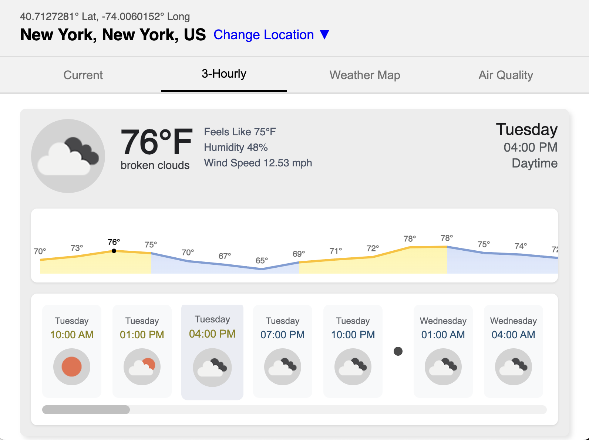

# Weather App

Built with React and Vite. HTML, CSS, and JavaScript are included.

## Quick View

[View Weather App On Vercel](https://docs.github.com)

## Features

- Responsive design
- Anchor links for smooth navigation
- Location-based
- Uses Open Weather Map's API
- Screen reader accessibility

## Preview



## Getting Started

1. Clone the repo:
   ```bash
   git clone https://github.com/SilentViewer807/Wordle-Game.git
   ```
2. Install dependencies:
   ```bash
   npm install
   ```
3. Set up environment variables:
   * Create a file named `.env` in the root directory.
   * Add your OpenWeather API key inside the file:
     ```env
     VITE_OPENWEATHER_API_KEY=your_own_api_key
     ```
4. Run the development server:
   ```bash
   npm run dev
   ```

## License

This project is open source and available under the MIT License.
